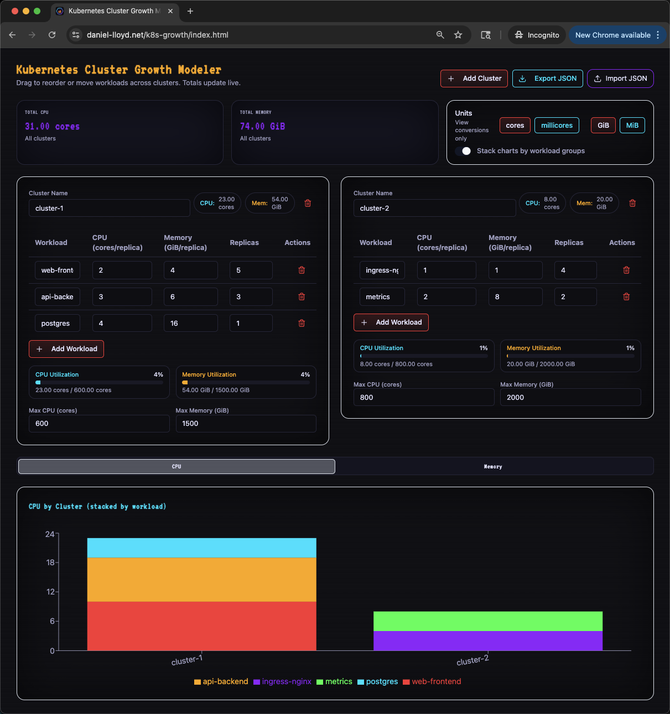

# Kubernetes Cluster Growth Modeler

A web app for modeling Kubernetes cluster capacity growth.

You can define clusters and workloads and set workload's CPU/memory usage. You can set clusters' CPU/memory capacity limits to visualize utilization. 
Supports JSON import/export and drag-and-drop workloads between clusters.



[https://www.daniel-lloyd.net/k8s-growth/index.html](https://www.daniel-lloyd.net/k8s-growth/index.html)

## Contributing

### Prerequisites

- [nvm](https://github.com/nvm-sh/nvm) (Node Version Manager)
- Node.js (recommended: **22.x LTS**)
- npm (bundled with Node)

---

### Clone the repository

```bash
git clone https://github.com/your-org/cluster-growth-modeler.git
cd cluster-growth-modeler/k8s-growth
```

### Select Node version

```bash
nvm install 22
nvm use 22
```

### Install dependencies

```bash
npm install
```

### Development

Run the local development server with hot reload:

```bash
npm run dev
```

### Build

Create an optimized production build:

```bash
npm run build
```

## Deploy

### Scripted

```bash
deploy.sh E1E345POA9DNH3
```

### Manual

1. Upload static files to S3

```bash
aws s3 sync dist/ s3://www-daniel-lloyd-net/k8s-growth/ --delete
```

2. Invalidate cache in CloudFront

```bash
aws cloudfront create-invalidation --distribution-id E1E345POA9DNH3 --paths "/k8s-growth/index.html"
```

3. Check Invalidation status

```
aws cloudfront get-invalidation \
  --distribution-id E1E345POA9DNH3 \
  --id INSERT_INVALIDATION_ID

```

## Project Structure

- src/ — React components, hooks, and helpers

  - src/ClusterGrowthModeler.tsx - Primary code lives here

- public/ — Static assets

- vite.config.ts — Vite configuration

- package.json — npm scripts and dependencies

## Importing Data from Prometheus

The web app supports importing JSON files generated by the `utils/prometheus_metrics_exporter.py` script, which exports CPU and memory utilization per namespace/cluster.
